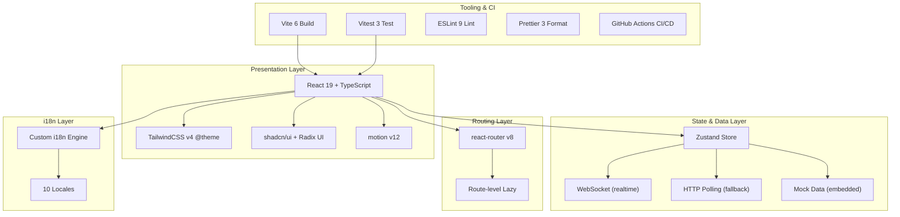
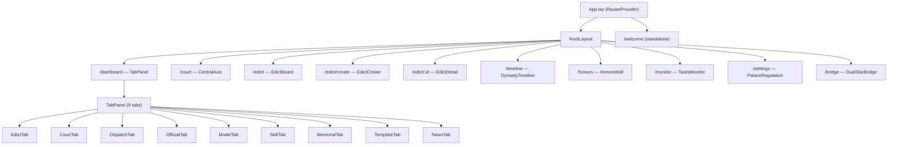
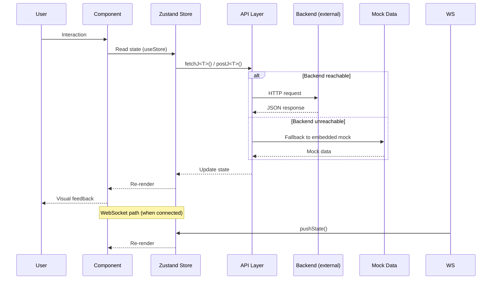

<div align="center">

# YYC³ Dynasty · 三省六部

**AI Agent 协作管理看板 — 三省六部，君臣共治**
<br />
**AI Agent Collaboration Dashboard — Three Departments, Six Ministries**


**YanYuCloudCube** — _言启象限 · 语枢未来_
<br />
_Words Initiate Quadrants, Language Serves as Core for Future_

---

<!-- ============================== Badges ============================== -->

[](https://github.com/YYC-Cube/YYC3-Dynasty/actions/workflows/ci.yml)
[](https://github.com/YYC-Cube/YYC3-Dynasty/actions/workflows/deploy.yml)
[](https://github.com/YYC-Cube/YYC3-Dynasty/actions/workflows/lighthouse.yml)
[](https://github.com/YYC-Cube/YYC3-Dynasty/actions/workflows/release.yml)
<br />
[](https://www.typescriptlang.org/)
[](https://react.dev/)
[](https://vite.dev/)
[](https://tailwindcss.com/)
[](https://zustand-demo.pmnd.rs/)
[](https://reactrouter.com/)
[](https://vitest.dev/)
[](https://ui.shadcn.com/)
<br />
[](https://github.com/YYC-Cube/YYC3-Dynasty/actions)
[](https://github.com/YYC-Cube/YYC3-Dynasty/actions)
[](LICENSE)
[](https://github.com/YYC-Cube/YYC3-Dynasty/releases)
[](https://github.com/YYC-Cube/YYC3-Dynasty/commits/main)
[](docs/CONTRIBUTING.md)
[](Dockerfile)

---

</div>

---

## Table of Contents / 目录

<!-- prettier-ignore-start -->
<!-- markdownlint-disable MD033 -->
<details open>
<summary><strong>Expand / 展开</strong></summary>

- [Project Overview / 项目简介](#project-overview--项目简介)
- [Features / 特性](#features--特性)
- [Architecture / 体系架构](#architecture--体系架构)
- [Tech Stack / 技术栈](#tech-stack--技术栈)
- [Quick Start / 快速开始](#quick-start--快速开始)
- [Scripts Reference / 命令参考](#scripts-reference--命令参考)
- [Routes / 路由](#routes--路由)
- [Project Structure / 项目结构](#project-structure--项目结构)
- [Developer Guide / 开发者指南](#developer-guide--开发者指南)
- [CI/CD Pipeline / 持续集成与部署](#cicd-pipeline--持续集成与部署)
- [Deployment Guide / 部署指南](#deployment-guide--部署指南)
- [Testing / 测试](#testing--测试)
- [Code Quality / 代码质量](#code-quality--代码质量)
- [Documentation / 文档导航](#documentation--文档导航)
- [Contributing / 贡献指南](#contributing--贡献指南)
- [License / 许可证](#license--许可证)

</details>
<!-- markdownlint-enable MD033 -->
<!-- prettier-ignore-end -->

---

## Project Overview / 项目简介

**YYC³ Dynasty · 三省六部** is a frontend-only React SPA that reimagines an AI-Agent collaboration dashboard through the lens of the classical Chinese **Three Departments and Six Ministries (三省六部)** governance system. It visualizes task flow, agent status, and performance using imperial-court metaphors — edicts (圣旨), jade seal (玉玺), ministries (六部), and more.

> **Design Philosophy**: The Luoyang Forbidden City central axis serves as the spatial metaphor for the AI workflow pipeline — from imperial decree issuance through sorting, drafting, deliberation, dispatch, execution, and finally archival.

Built with the Luoyang Forbidden City central axis as its spatial metaphor, the system maps the complete AI agent workflow lifecycle — from task creation through approval, execution, monitoring, and archival — onto the imperial court operational framework.

**Live Demo**: [https://dynasty.yyc3.fun/](https://dynasty.yyc3.fun/)

---

## Features / 特性

### Core Modules / 核心模块

| Module / 模块 | Route / 路由 | Description / 说明 |
|---------------|-------------|-------------------|
| **统一看板** / Dashboard | `/dashboard` | Tab 式控制中心，聚合 9 大面板：旨意/朝堂/调度/官员/模型/技能/奏折/模板/要闻。<br/>Central control hub with 9 tabbed panels. |
| **朝堂议政** / Court | `/court` | 多 Agent 实时讨论，中轴线节点叙事 + 天子驾六交互。<br/>Multi-agent real-time discussion with central-axis narrative. |
| **旨意看板** / Edict Board | `/edict` | 圣旨式任务管理，七阶 Pipeline 流转追踪。<br/>Imperial-edict task management with 7-stage pipeline tracking. |
| **旨意工坊** / Edict Create | `/edict/create` | 圣旨卷轴样式的拟旨界面。<br/>Scroll-style edict creation interface. |
| **敕令详情** / Edict Detail | `/edict/:id` | 签章链 + 全流转日志。<br/>Seal chain + full routing log. |
| **太史监候** / Monitor | `/monitor` | 系统运行状态监控，Agent 健康检查，告警阈值配置。<br/>System monitoring, agent health checks, alert thresholds. |
| **勋章墙** / Honors | `/honors` | 17 种古典主题成就徽章，1–6 星稀有度分级。<br/>17 classical-themed achievement badges, 1–6 star rarity tiers. |
| **王朝时间轴** / Timeline | `/timeline` | 十三王朝技能矩阵时间线。<br/>Thirteen-dynasty skill matrix timeline. |
| **双星桥** / Bridge | `/bridge` | YYC³ AI Family (8 members) 与三省六部 (12 ministers) 协同映射。<br/>Cross-mapping between AI Family and court ministers. |
| **宫阙规制** / Settings | `/settings` | 系统配置：朝堂/旨意/令牌/通知/安全/外观/典章。<br/>System settings across 7 categories. |
| **欢迎入口** / Welcome | `/welcome` | 玉玺启宫门动画入口。<br/>Jade seal animated entry. |

### Key Highlights / 亮点

- **Honors System / 勋章系统**: 17 achievement badges across 6 rarity tiers (1–6 stars), themed after classical Chinese motifs. Badges auto-unlock based on task completion, agent usage, and system milestones.
- **i18n / 国际化**: Support for 10 languages (中文, English, 日本語, 한국어, Français, Deutsch, Español, Português, Русский, العربية) with a custom zero-dependency implementation.
- **Realtime / 实时更新**: WebSocket connection with exponential-backoff auto-reconnect; HTTP polling fallback at configurable intervals.
- **Theming / 主题**: Dynasty dark palette — deep indigo backgrounds, aged parchment surfaces, cinnabar/vermillion accents, gold highlights. TailwindCSS v4 `@theme` tokens throughout.
- **Animations / 动效**: motion (framer-motion v12) powered transitions, scroll-triggered entrances, and gesture-based interactions.
- **Responsive / 响应式**: Adapts from desktop (primary) to tablet with graceful degradation.

---

## Architecture / 体系架构

### Workflow Pipeline / 工作流管道

The system maps AI agent task processing onto the classical seven-stage imperial court workflow:

```
天堂(天子) ──→ 明堂(太子) ──→ 应天门(三省) ──→ 天津桥(六部) ──→ 端门(早朝) ──→ 定鼎门(归档)
    │                │                │                  │              │              │
  下旨             分拣            草拟·审议·派发         执行           监控           归档
 Issue            Sort            Draft·Deliber·Deliver  Execute        Monitor       Archive
Stage 1          Stage 2             Stage 3-5           Stage 6       Stage 7       Stage 8
```

### Application Architecture / 应用架构



### Component Tree / 组件树



### Data Flow / 数据流



---

## Tech Stack / 技术栈

| Technology / 技术 | Version / 版本 | Purpose / 用途 |
|-------------------|---------------|----------------|
| **React** | 19.1 | UI framework (with `useOptimistic`, `useActionState`) |
| **TypeScript** | 5.9 | Type safety (strict mode, `tsc --noEmit`) |
| **Vite** | 6.4 | Build tool (route-level code-splitting + vendor chunks) |
| **TailwindCSS** | 4.1 | Styling system (CSS-first `@theme` tokens) |
| **Zustand** | 5 | State management (single store + polling/WS) |
| **react-router** | 8.2 | Routing (`createBrowserRouter` + `lazy()`) |
| **shadcn/ui + Radix UI** | — | UI primitives (40+ components, accessible) |
| **motion** | 12 | Animation engine (framer-motion v12 unified) |
| **Recharts** | 3.8 | Chart visualization |
| **Vitest** | 3 | Unit testing (with `@testing-library/react`) |
| **ESLint** | 9 | Code linting (flat config, TS + React Hooks) |
| **Prettier** | 3 | Code formatting |
| **Docker** | — | Containerization (multi-stage, nginx runtime, ~25 MB) |

---

## Quick Start / 快速开始

### Prerequisites / 前置要求

- **Node.js** >= 20 (recommended: 22 LTS)
- **pnpm** >= 10

```bash
# 检查版本 / Check versions
node --version  # >= 20
pnpm --version  # >= 10
```

### Installation & Dev Server / 安装与开发

```bash
# 克隆仓库 / Clone the repository
git clone https://github.com/YYC-Cube/YYC3-Dynasty.git
cd YYC3-Dynasty

# 安装依赖 / Install dependencies
pnpm install

# 启动开发服务器 / Start dev server → http://localhost:3122
pnpm dev

# 在另一个终端运行类型检查 / Type check (separate terminal)
pnpm typecheck

# 运行测试 / Run tests
pnpm test
```

### Build for Production / 生产构建

```bash
pnpm build           # 构建 → dist/
pnpm preview         # 预览生产构建
```

---

## Scripts Reference / 命令参考

| Command / 命令 | Description / 说明 |
|----------------|-------------------|
| `pnpm dev` | Start Vite dev server (port 3122, LAN accessible) |
| `pnpm build` | Production build (`dist/`, route-splitting + vendor chunks) |
| `pnpm preview` | Preview production build locally |
| `pnpm typecheck` | `tsc --noEmit` strict type check (must be 0 errors) |
| `pnpm lint` | ESLint v9 flat config check |
| `pnpm lint:fix` | ESLint auto-fix |
| `pnpm format` | Prettier format all source/config files |
| `pnpm format:check` | Prettier compliance check (CI gate) |
| `pnpm test` | Run Vitest test suite |
| `pnpm test:watch` | Vitest watch mode |
| `pnpm test:coverage` | Run with v8 coverage report |
| `pnpm check:circular` | madge circular dependency detection |
| `pnpm check:dead` | knip dead code / unused dependency check |
| `pnpm check:all` | Full CI gate: typecheck → lint → test → build |
| `pnpm version:patch` | Bump patch version (`npm version patch`) |
| `pnpm version:minor` | Bump minor version |
| `pnpm version:major` | Bump major version |

---

## Routes / 路由

| Path / 路径 | Page / 页面 | Description / 说明 | Lazy |
|-------------|------------|-------------------|------|
| `/welcome` | Welcome | 玉玺启宫门动画入口 / Jade seal entry animation | ✅ |
| `/` | RootLayout | 壳布局，`index` 重定向到 `/welcome` / Shell layout | ✅ |
| `/dashboard` | Dashboard | 统一看板 (9-tab 面板) / Central hub | ✅ |
| `/court` | Court | 朝堂议政 — 中轴线 + 天子驾六 / Court discussion | ✅ |
| `/timeline` | Timeline | 十三王朝技能矩阵 / 13-dynasty skill matrix | ✅ |
| `/honors` | Honors | 勋章墙 (17 徽章) / Achievement honors wall | ✅ |
| `/edict` | EdictBoard | 旨意看板 — 七阶流转 / Edict pipeline board | ✅ |
| `/edict/create` | EdictCreate | 旨意工坊 — 拟旨 / Edict creation workshop | ✅ |
| `/edict/:id` | EdictDetail | 敕令详情 — 签章链 / Edict detail with seal chain | ✅ |
| `/monitor` | TaishiMonitor | 太史监候 — 系统监控 / System monitoring | ✅ |
| `/settings` | PalaceRegulation | 宫阙规制 — 系统设置 / System settings | ✅ |
| `/bridge` | DualStarBridge | 双星桥 — Family × Dynasty 映射 / Cross-mapping bridge | ✅ |

All routes use react-router v8 `lazy()` for **route-level code-splitting** — each page loads on-demand as a separate chunk.

---

## Project Structure / 项目结构

```
YYC3-Dynasty/
├── public/                       # Static assets
│   ├── CNAME                     # Custom domain (dynasty.yyc3.fun)
│   ├── Family-001.png            # Project hero image
│   ├── site.webmanifest          # PWA manifest
│   └── yyc3-icons/Web App/       # Cross-platform icons (favicon, apple-touch, android)
├── src/
│   ├── main.tsx                  # React root (StrictMode → #root)
│   ├── app/
│   │   ├── App.tsx               # RouterProvider
│   │   ├── routes.tsx            # All routes (lazy)
│   │   ├── store.ts              # Zustand store + domain constants
│   │   ├── store.test.ts         # Store unit tests (37 cases)
│   │   ├── api.ts                # Fetch wrapper + mock fallback + TS types
│   │   ├── api.test.ts           # API tests (49 cases)
│   │   ├── i18n.ts               # Custom i18n engine (10 locales)
│   │   ├── i18n.test.ts          # i18n tests (22 cases)
│   │   ├── useWebSocket.ts       # WS hook with exponential-backoff reconnect
│   │   └── components/
│   │       ├── ui/               # shadcn/ui primitives (40+ components)
│   │       ├── figma/            # Figma-Make helpers (ImageWithFallback)
│   │       ├── Dashboard.tsx     # Tabbed dashboard container
│   │       └── *.tsx             # Feature components
│   ├── styles/
│   │   ├── index.css             # Aggregate entry
│   │   ├── fonts.css             # Google Fonts imports (Noto Serif SC, JetBrains Mono, Zhi Mang Xing)
│   │   ├── tailwind.css          # @import 'tailwindcss'
│   │   └── theme.css             # @theme tokens (dynasty dark palette)
│   └── lib/i18n-react/           # i18n React binding
├── docs/                         # Design specs, guidelines, reference monorepo
│   ├── ARCHITECTURE.md           # Architecture overview
│   ├── API.md                    # API documentation
│   ├── CONTRIBUTING.md           # Contribution guide
│   ├── OPERATIONS.md             # Operations manual + troubleshooting
│   ├── ROADMAP.md                # P0–P5 iteration roadmap (all phases closed)
│   ├── QUALITY_REPORT.md         # Code quality audit report (Grade A)
│   └── guidelines/               # Design system specifications
├── .github/workflows/            # CI/CD pipeline (6 workflows)
│   ├── ci.yml                    # Quality gate (typecheck + lint + test + build)
│   ├── deploy.yml                # GitHub Pages deployment
│   ├── lighthouse.yml            # Lighthouse CI performance audit
│   └── release.yml               # Docker image + GitHub Release
└── config files                  # vite.config.ts, vitest.config.ts, eslint.config.mjs, etc.
```

---

## Developer Guide / 开发者指南

### Adding a New Page / 新增页面

1. **Create component**: `src/app/components/MyPage.tsx` with standard file header and named export
2. **Register route**: `src/app/routes.tsx` under `RootLayout`'s `children`
3. **Add API types**: Endpoint + TypeScript interface in `src/app/api.ts`
4. **Add store action**: Fetch action + tab key in `src/app/store.ts`
5. **Add i18n strings**: Both `zhCN` and `en` maps in `src/app/i18n.ts`
6. **Use theme tokens**: shadcn primitives + `bg-bg-primary`, `text-accent-gold`, etc.
7. **Verify**: `pnpm typecheck && pnpm lint && pnpm test && pnpm build`

### Code Conventions / 编码规范

- **File header**: Every source file must start with the standard JSDoc header (see [AGENTS.md §4](AGENTS.md))
- **Naming**: Components → `PascalCase.tsx`, Hooks → `camelCase.ts`, Styles → `kebab-case.css`
- **Imports**: Use `@/` path alias for `src/` (configured in `tsconfig.json` + `vite.config.ts`)
- **State**: One Zustand store — `useStore`. Never create additional stores.
- **API**: All fetch calls through `api` object in `src/app/api.ts` — never direct `fetch` calls.
- **i18n**: Use `t(key, params?)` from `useLocale()` — never hardcode user-facing strings.
- **Styling**: TailwindCSS v4 `@theme` tokens — never inline hex colors.
- **Comments**: Chinese inline comments (team norm).

### File Header Template / 文件头模板

```ts
/**
 * file: ComponentName.tsx
 * description: 组件功能描述
 * author: YanYuCloudCube Team
 * version: v1.0.0
 * created: 2026-07-16
 * updated: 2026-07-16
 * status: active
 * tags: [tag1],[tag2]
 *
 * brief: one-line summary
 *
 * details:
 * - bullet points
 *
 * dependencies: ...
 * exports: ...
 */
```

### State Management / 状态管理

- **Zustand store** (`src/app/store.ts`): Holds both server data and UI state in a single store.
- **Polling**: `startPolling()` / `stopPolling()` drive countdown. Interval = `POLL_INTERVAL_HTTP` (5s) when WS is down, `POLL_INTERVAL_WS` (30s) when WS is up.
- **WebSocket** (`src/app/useWebSocket.ts`): Module-level singleton. Cleanup only removes listeners, never closes the socket. Call `wsDisconnect()` on page unload only.
- **Toasts**: Auto-dismiss after 3000ms via `toastEmitter.ts` event bus.

---

## CI/CD Pipeline / 持续集成与部署

### Pipeline Chain / 管道链路

```
Git Push / PR
    │
    ▼
┌─────────────────────────────────────────────────────────────┐
│  ci.yml — Quality Gate (Node 20 + 22)                       │
│  ├── pnpm audit (high severity gate)                        │
│  ├── pnpm typecheck (0 errors required)                     │
│  ├── pnpm lint (0 errors, 0 warnings)                       │
│  ├── pnpm format:check (Prettier compliance)                │
│  ├── pnpm test:coverage (320 tests, 92.9% coverage)         │
│  ├── pnpm check:circular (0 circular deps)                  │
│  └── pnpm build (production bundle)                         │
└──────────────────────┬──────────────────────────────────────┘
                       │  ✅ CI passes
                       ▼
┌─────────────────────────────────────────────────────────────┐
│  deploy.yml — GitHub Pages Deployment                       │
│  ├── Build (VITE_API_URL from GitHub Variables)             │
│  ├── Upload artifact (dist/)                                │
│  ├── Deploy to GitHub Pages                                 │
│  └── Smoke test (5 retries @ 15s = 75s max)                │
└──────────────────────┬──────────────────────────────────────┘
                       │  ✅ Deployment complete
                       ▼
┌─────────────────────────────────────────────────────────────┐
│  lighthouse.yml — Performance Audit                         │
│  ├── Collect (3 URLs: /, /welcome, /dashboard)             │
│  ├── Assert (Perf≥75, A11y≥90, BP≥90, SEO≥90)             │
│  └── Report (uploaded as artifact, 14-day retention)        │
└─────────────────────────────────────────────────────────────┘

Tag v*.*.* push:
    └── release.yml — Docker (multi-arch) + GitHub Release
```

### Workflow Details / 工作流详情

| Workflow | Trigger | Key Actions | Artifacts |
|----------|---------|-------------|-----------|
| **CI** | Push (main/develop), PR | Typecheck, Lint, Test, Build | Coverage report, Build output |
| **Deploy Pages** | CI success on main | Build → Deploy → Smoke test | `dist/` on GitHub Pages |
| **Lighthouse CI** | Deploy success | Performance audit (3 URLs) | Lighthouse report |
| **Release** | Tag `v*.*.*` | Docker multi-arch build + GitHub Release | Docker image, Release notes |

### Prerequisites / 前置配置

- **GitHub Pages source**: Repository → Settings → Pages → Build and deployment → Source → **GitHub Actions**
- **Custom domain**: `public/CNAME` contains `dynasty.yyc3.fun` — automatically deployed with each build
- **VITE_API_URL** (optional): Add `VITE_API_URL` to GitHub → Settings → Secrets and variables → Actions → **Variables**
  - If not set, the app falls back to embedded mock data

---

## Deployment Guide / 部署指南

### Docker / Docker 部署

```bash
# 构建镜像（~25 MB）
docker build -t yyc3-dynasty .

# 运行（容器内部 80 → 宿主机 3122）
docker run -p 3122:80 yyc3-dynasty

# 注入后端 API 地址
docker build --build-arg VITE_API_URL=https://api.example.com -t yyc3-dynasty .
```

**Dockerfile features**: Multi-stage build (pnpm builder → nginx-alpine runtime), Gzip compression, SPA fallback, security headers, non-root user.

### GitHub Pages / GitHub Pages 部署

Push to `main` branch → CI quality gate → automatic deployment.

- **URL**: [https://dynasty.yyc3.fun](https://dynasty.yyc3.fun)
- **Custom domain**: via `public/CNAME`
- **Trigger**: `workflow_run` on CI success (quality gate must pass first)

### Production Build / 生产构建

```bash
pnpm build                    # → dist/
ls -la dist/                  # Verify output
pnpm preview                  # Local preview on port 4173
```

---

## Testing / 测试

| Suite | File | Cases | Focus |
|-------|------|-------|-------|
| Store | `src/app/store.test.ts` | 37 | State management, polling, edge cases |
| API layer | `src/app/api.test.ts` | 49 | Fetch wrapper, mock fallback, error handling |
| i18n | `src/app/i18n.test.ts` | 22 | Translation lookup, locale switching, fallback chains |
| Components | (various) | 212 | UI component rendering, interaction, accessibility |

**Total**: 320 test cases across 10 files, 92.93% statement coverage.

```bash
pnpm test                # Run all tests
pnpm test:watch          # Watch mode for TDD
pnpm test:coverage       # Run with coverage report
```

---

## Code Quality / 代码质量

| Metric | Status | Target |
|--------|--------|--------|
| TypeScript errors | **0** (strict mode) | 0 |
| ESLint errors/warnings | **0/0** | 0/0 |
| Prettier compliance | **100%** | 100% |
| Test pass rate | **100%** (320/320) | 100% |
| Statement coverage | **92.93%** | ≥80% |
| Branch coverage | **84.38%** | ≥75% |
| Circular dependencies | **0** | 0 |
| Dead code (knip) | **0 unused** | 0 |
| Bundle size (initial) | **~294 kB gzip** | — |

---

## Documentation / 文档导航

| Document / 文档 | Description / 说明 |
|-----------------|-------------------|
| [AGENTS.md](AGENTS.md) | **Agent Collaboration Guide** — commands, architecture, pitfalls, deployment. Must-read for new contributors. |
| [CHANGELOG.md](CHANGELOG.md) | Version history (Keep a Changelog format). |
| [docs/ARCHITECTURE.md](docs/ARCHITECTURE.md) | Detailed architecture overview. |
| [docs/API.md](docs/API.md) | API interface documentation. |
| [docs/OPERATIONS.md](docs/OPERATIONS.md) | Engineering summary + operations manual + troubleshooting. |
| [docs/ROADMAP.md](docs/ROADMAP.md) | P0–P5 iteration roadmap (all phases closed). |
| [docs/QUALITY_REPORT.md](docs/QUALITY_REPORT.md) | Code quality audit report (Grade A). |
| [docs/CONTRIBUTING.md](docs/CONTRIBUTING.md) | Contribution guide. |
| [docs/guidelines/Guidelines.md](docs/guidelines/Guidelines.md) | Full design system specification (typography, colors, motifs, animation). |

---

## Contributing / 贡献指南

We welcome contributions of all kinds! Please see [CONTRIBUTING.md](docs/CONTRIBUTING.md) for detailed guidelines.

**Quick checklist**:
1. Fork the repository
2. Create a feature branch (`git checkout -b feature/amazing-feature`)
3. Make your changes
4. Run `pnpm check:all` (typecheck → lint → test → build — must all pass)
5. Commit with descriptive message (`git commit -m 'feat: add amazing feature'`)
6. Push and open a Pull Request

---

## License / 许可证

This project is licensed under the **MIT License** — see the [LICENSE](LICENSE) file for details.

The UI component library [shadcn/ui](https://ui.shadcn.com/) is licensed under MIT. See [ATTRIBUTIONS.md](ATTRIBUTIONS.md) for third-party attributions.

---

<div align="center">

---

_言启千行代码 · 语枢万物智能_
<br />
_Words Initiate Thousands of Lines of Code, Language Serves as the Core for Universal Intelligence_
<br />
_三省以治 · 六部以行_
<br />
_Three Departments Govern, Six Ministries Execute_

<br />

<sub>
Built with ❤️ by <a href="https://github.com/YYC-Cube">YanYuCloudCube Team</a>
<br />
<a href="https://dynasty.yyc3.fun/">Live Demo</a> · 
<a href="https://github.com/YYC-Cube/YYC3-Dynasty">GitHub</a> · 
<a href="https://github.com/YYC-Cube">YYC³ AI Family</a>
</sub>

</div>
